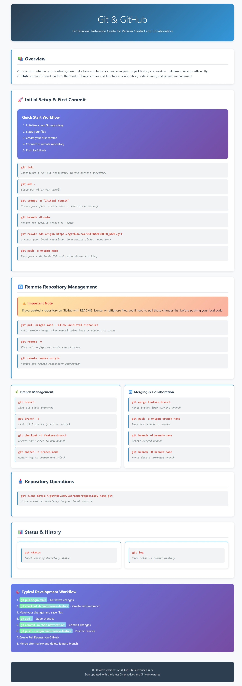
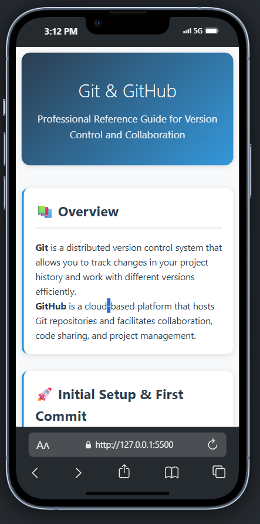

# 🚀 Git & GitHub Professional Reference Guide

[](https://opensource.org/licenses/MIT)
[](https://developer.mozilla.org/en-US/docs/Web/HTML)
[](https://developer.mozilla.org/en-US/docs/Web/CSS)
[](https://developer.mozilla.org/en-US/docs/Web/JavaScript)

> A comprehensive, interactive reference guide for Git version control and GitHub collaboration - designed for developers at all levels.

## 📖 Overview

This project provides a beautifully designed, professional reference guide for Git and GitHub commands. Whether you're a beginner learning version control or an experienced developer who needs a quick reference, this guide has you covered.

### ✨ Features

- **🎨 Modern UI/UX**: Clean, professional design with responsive layout
- **📋 One-Click Copy**: Copy any command to clipboard instantly
- **🔄 Complete Workflows**: Step-by-step guides for common Git operations
- **📱 Mobile Friendly**: Fully responsive design works on all devices
- **🎯 Organized Sections**: Logically grouped commands for easy navigation
- **💡 Pro Tips**: Important notes and best practices highlighted
- **🌐 Multi-language Support**: Commands with descriptions in English and Hindi

## 🖥️ Live Demo

Visit the live guide: [Git & GitHub Reference Guide](https://your-username.github.io/Git-GitHub-Guide)

## 📸 Screenshots

<div align="center">
  
  <br>
  <em>Desktop View</em>
</div>

<div align="center">
  
  <br>
  <em>Mobile View</em>
</div>

## 🚀 Quick Start

### Option 1: Clone the Repository
```bash
git clone https://github.com/RSJK2562/Git-GitHub-Guide.git
cd Git-GitHub-Guide
```

### Option 2: Download ZIP
Download the repository as a ZIP file and extract it to your desired location.

### Option 3: Use GitHub Pages
Simply visit the live demo link above to use the guide directly in your browser.

## 📁 Project Structure

```
Git-GitHub-Guide/
├── index.html          # Main HTML file with the complete guide
├── README.md           # This file
├── LICENSE             # MIT License
├── assets/
│   ├── screenshot-desktop.png
│   └── screenshot-mobile.png
└── .gitignore
```

## 🛠️ Technologies Used

- **HTML5**: Semantic markup and structure
- **CSS3**: Modern styling with CSS Grid, Flexbox, and custom properties
- **JavaScript**: Interactive features and clipboard functionality
- **Responsive Design**: Mobile-first approach with CSS media queries

## 📚 What's Covered

### 🔧 Core Git Commands
- Repository initialization
- Staging and committing changes
- Branch management and switching
- Merging and collaboration

### 🌐 GitHub Integration
- Remote repository setup
- Pushing and pulling changes
- Branch management on remote
- Collaboration workflows

### 🎯 Development Workflows
- Initial project setup
- Feature branch workflow
- Pull request process
- Best practices and tips

## 🎨 Design Features

- **Modern Color Scheme**: Professional blue and gray palette
- **Typography**: Clean, readable fonts with proper hierarchy
- **Interactive Elements**: Hover effects and smooth transitions
- **Card-based Layout**: Organized sections with visual separation
- **Gradient Accents**: Subtle gradients for visual appeal
- **Copy-to-Clipboard**: One-click command copying functionality

## 🤝 Contributing

Contributions are welcome! Here's how you can help:

1. **Fork** the repository
2. **Create** a feature branch (`git checkout -b feature/AmazingFeature`)
3. **Commit** your changes (`git commit -m 'Add some AmazingFeature'`)
4. **Push** to the branch (`git push origin feature/AmazingFeature`)
5. **Open** a Pull Request

### 💡 Contribution Ideas

- Add more Git commands and examples
- Improve mobile responsiveness
- Add dark mode support
- Include more workflow examples
- Add interactive Git visualizations
- Translate to more languages

## 🐛 Bug Reports & Feature Requests

Found a bug or have a feature request? Please open an issue on GitHub:

- **Bug Report**: [Create Bug Report](https://github.com/RSJK2562/Git-GitHub-Guide/issues/new?template=bug_report.md)
- **Feature Request**: [Request Feature](https://github.com/RSJK2562/Git-GitHub-Guide/issues/new?template=feature_request.md)

## 📄 License

This project is licensed under the MIT License - see the [LICENSE](LICENSE) file for details.

## 👨‍💻 Author

**Mr. Ravi (RSJK2562)**

- GitHub: [@RSJK2562](https://github.com/RSJK2562)
- LinkedIn: [Connect with me](https://linkedin.com/in/your-profile)
- Email: your.email@example.com

## 🙏 Acknowledgments

- Inspired by the need for a comprehensive Git reference
- Thanks to the open-source community for Git and GitHub
- Special thanks to all contributors and users

## 📈 Project Stats


## 🔗 Useful Links

- [Git Official Documentation](https://git-scm.com/doc)
- [GitHub Docs](https://docs.github.com/)
- [Git Cheat Sheet](https://education.github.com/git-cheat-sheet-education.pdf)
- [Interactive Git Tutorial](https://learngitbranching.js.org/)

---

<div align="center">
  <p>⭐ Star this repository if you find it helpful!</p>
  <p>Made with ❤️ by <a href="https://github.com/RSJK2562">Mr. Ravi</a></p>
</div>